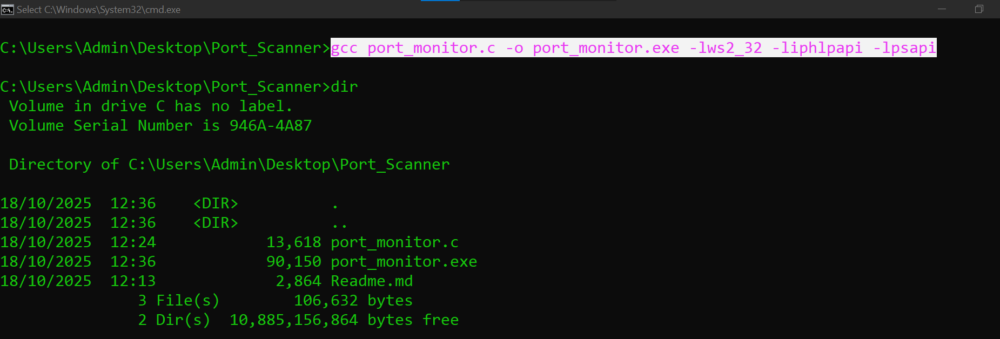
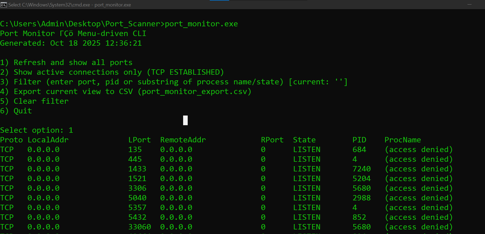
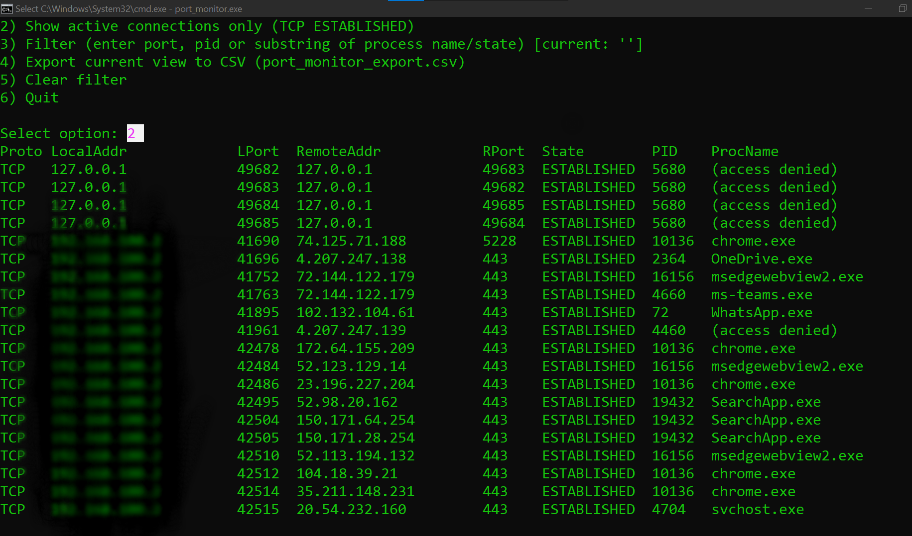
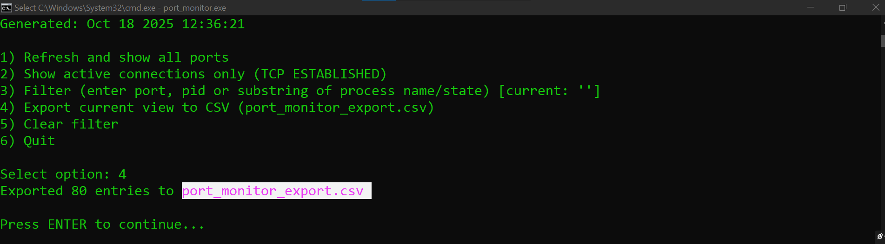
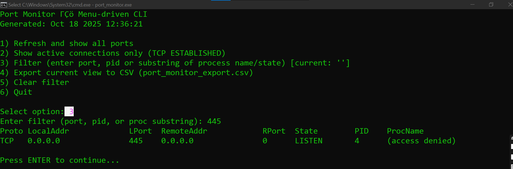

## 🧩 PORT MONITOR
A single-file, menu-driven C port monitoring tool for Windows and Linux.
Lists TCP/UDP sockets, active connections, PIDs, and process names — right from your terminal.
## ⚙️ FEATURES
• List listening TCP & UDP ports
• Show active TCP connections (ESTABLISHED)
• Display PID and process name (when available)
• Filter by port, PID, process name, or connection state
• Export visible entries to CSV (port_monitor_export.csv)
• NEW: Target Host/IP Mode
     → Enter an IP or hostname (auto-resolves to IPv4)
     → View only entries involving that address
## 🧱 BUILD INSTRUCTIONS
### 🐧 LINUX
 `sudo apt update`
  `sudo apt install build-essential`
   `gcc port_monitor.c -o port_monitor`

###  WINDOWS (MSYS2 / MinGW-w64)
  `pacman -Syu`
   `pacman -S mingw-w64-x86_64-gcc`
    `gcc port_monitor.c -o port_monitor.exe -lws2_32 -liphlpapi -lpsapi`
## 🧭 USAGE
# Linux
  `./port_monitor`

# Windows
   `port_monitor.exe`
## 🧮 MENU OVERVIEW
0) Set target host/IP (limit view to specific address)
1) Refresh and show all ports
2) Show active connections only (TCP ESTABLISHED)
3) Filter (by port, PID, process name, or state)
4) Export current view to CSV
5) Clear filter
6) Quit
## 🎯 TARGET HOST/IP MODE
• Enter an IPv4 address (e.g. 192.168.1.10)
• Or a hostname (e.g. example.com)
     → Automatically resolves to IPv4
• Blank input clears the target
• When set, only entries with that address appear
• Filter also affects CSV export
## 🔍 FILTERING
Filter string matches any of:
   - Local port number (as text)
   - PID
   - Process name substring
   - Connection state (LISTEN, ESTABLISHED, etc.)
Use option 5 to clear the filter.
## 📤 EXPORTING TO CSV
Select option 4 to export current entries to:
    port_monitor_export.csv
## 💡 EXAMPLE SESSION
  `./port_monitor`

Select: 0
→ Enter target host/IP: example.com
→ Resolved: 93.184.216.34

Select: 1
→ Showing only entries involving 93.184.216.34

Select: 4
→ Exported to port_monitor_export.csv
## ⚠️ LIMITATIONS
• IPv4 only (no IPv6 support)
• On Linux, reading /proc/<pid>/fd may need root
• Windows requires permission to read process info
• Parsing is best-effort (depends on OS version)
• No external dependencies — single source file
## 🔒 LEGAL & ETHICAL NOTICE
⚠️ This tool only monitors local connections.
Do NOT use it to scan or probe remote systems you don’t own.
Always comply with local laws and organizational policies.
## 🧰 QUICK BUILD & RUN
gcc port_monitor.c -o port_monitor
sudo ./port_monitor
## 🧾 LICENSE
MIT License
(c) 2025
## UI
## Screenshot — Main Menu

## Screenshot — All Ports

## Screenshot — Established Connections

## Screenshot — Set Target Host/IP

## Screenshot — Export CSV

